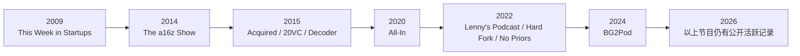
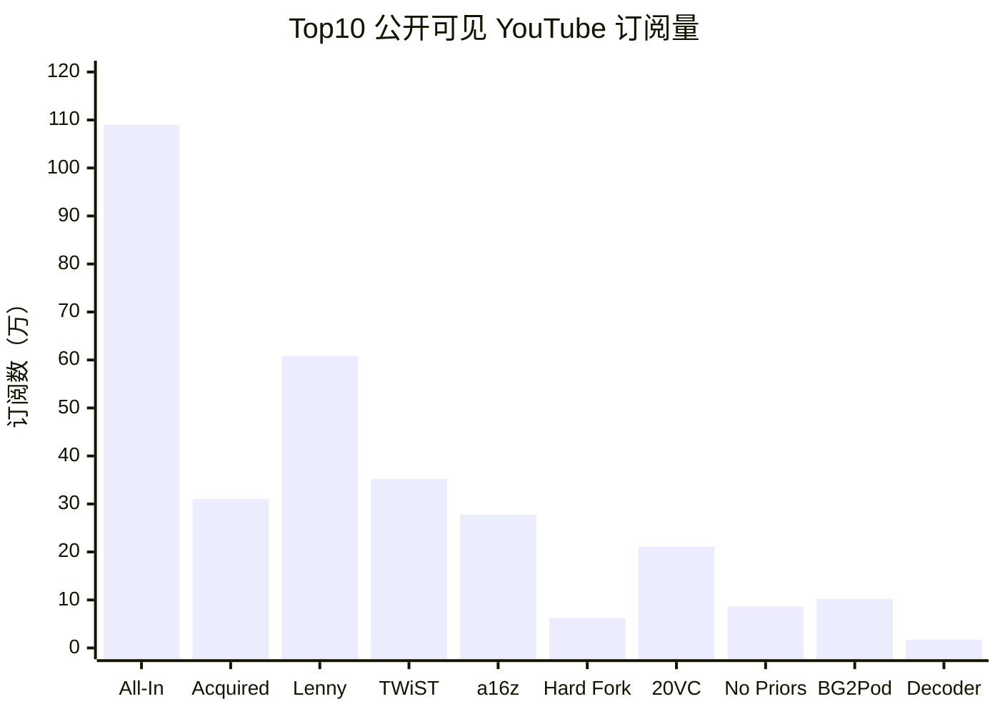

# 硅谷最火科技播客研究报告

## 执行摘要

本报告以“近三年内持续活跃，或虽非高频更新但在硅谷科技圈仍具显著影响力”为默认口径，对 **42 档** 与硅谷高度相关的科技播客进行梳理，覆盖三类主体：个人科技播主、创投机构、科技媒体；同时纳入总部不一定设在硅谷、但对硅谷创业、VC、AI 与大厂生态具有显著议程设置能力的节目。样本中的节目既包括 VC/创业圈“内参型”播客，也包括面向更大范围科技受众的媒体型节目。官方信息显示，这些节目多数仍在 2026 年保持更新或至少仍被母机构重点运营。citeturn12search2turn21search5turn9search1turn8search1turn25search0turn11search2turn30search1turn13search2turn33search1turn21search8

如果把“最火”理解为**公开规模 + 嘉宾/议题信号 + 活跃度 + 硅谷相关性**的综合结果，而不是单一平台订阅量，那么当前最稳妥的 Top 10 依次为：**All-In、Acquired、This Week in Startups、The a16z Show、Lenny’s Podcast、The Twenty Minute VC、Hard Fork、No Priors、BG2Pod、Decoder**。其中，All-In 兼具极高公开规模与圈层影响力；Acquired 代表“深度公司史/商业史”的长篇精品；This Week in Startups 仍是硅谷创业交叉点；a16z Show 是机构型内容机器；Lenny’s Podcast 则已成为产品、增长与 AI 工作流的重要入口。Apple Podcasts 与 YouTube 的公开指标亦支持这一结论：例如 All-In 在 Apple 上约有 **4.0/5、1 万条评分**，YouTube 约 **109 万订阅**；Acquired Apple 约 **4.7/5、4.9K 评分**，YouTube 约 **31 万订阅**；Lenny’s Podcast Apple 约 **4.9/5、1.4K 评分**，YouTube 约 **60.8 万订阅**。citeturn12search2turn4search0turn35search0turn12search0turn12search1turn37search12

从结构上看，**硅谷“最火”科技播客已出现三条主线**。第一条是“创业者/投资人主导的高密度谈话节目”，例如 All-In、20VC、BG2Pod、No Priors、Uncapped、Logan Bartlett Show。第二条是“机构化内容品牌”，如 a16z、Sequoia、YC、Greylock、First Round 等，通过官方播客把研究、投资叙事和生态网络对外输出。第三条是“媒体型解读节目”，如 Hard Fork、Decoder、The Vergecast、Equity、Pivot，用更成熟的采访和新闻方法把硅谷议题外溢到更广的商业与公共讨论。citeturn9search1turn13search11turn13search14turn26search1turn26search0turn8search1turn30search1turn16search2turn16search3turn16search0

另一个重要发现是：如果**只按 YouTube 可见规模**排序，Dwarkesh Podcast、TBPN 等节目会更靠前；但用户要求“梯队一 = 先前 Top10”，且本报告采用的是综合评分而非单平台订阅量，因此它们被放在梯队二或梯队三，并在文中单独解释其“规模不低但综合位次暂不进入 Top10”的原因。Dwarkesh Podcast 官方 YouTube 已约 **135 万订阅**，TBPN 官方 YouTube 约 **12.4 万订阅**，都说明它们是 2024–2026 期间强势崛起的增量力量。citeturn22search1turn24search3turn19search0

## 方法与数据来源说明

本报告按以下优先级取数：**官方渠道优先**，包括播客官网、Apple Podcasts 页面、官方 YouTube 频道、母机构官网；其次使用少量权威媒体或行业报道补足“下载量/影响力叙事”，例如《华尔街日报》《纽约时报》与 TechCrunch。由于绝大多数播客**不公开 RSS 下载量或平台内订阅量**，因此本报告将“公开规模”主要用以下替代指标来衡量：Apple Podcasts 评分数量、公开显示的总集数与活跃年限、YouTube 订阅数/视频观看表现、是否有高可见度 live event 或被主流媒体点名。所有检索日期默认记为 **2026-06-26**，除非特别注明为节目页或单集页上显示的发布日期。citeturn12search2turn12search0turn12search1turn9search1turn8search1turn25search0turn11search2turn16search3turn19search0

本报告采用的默认综合评分权重如下，这是因为用户未指定精确权重，但要求明确说明：**公开规模 50% + 嘉宾/议题信号 25% + 活跃度 15% + 硅谷相关性 10%**。其中，公开规模又拆分为三类替代变量：可公开核验的 YouTube 订阅/观看、Apple 评分数量、公开报道的下载或传播影响；若缺少其中一项，则以其余公开指标补足。嘉宾/议题信号则主要看是否长期触达 OpenAI、Anthropic、NVIDIA、Sequoia、YC、Stripe、Figma、Patreon、Ford、Intel 等硅谷关键公司或人物，以及是否持续讨论 AI、创业、VC、应用层与基础设施等核心议题。citeturn30search1turn32search0turn11search2turn13search1turn13search2turn14search13

样本划定上，本报告将“硅谷相关”广义理解为：节目主理人、母机构、核心受众或主要议题与硅谷创业和科技资本网络高度重合；因此像 Hard Fork、Pivot、Masters of Scale、Invest Like the Best 等并非全部总部位于硅谷的节目，也被纳入。相反，若节目虽谈商业或科技，但公开资料中与硅谷创业/VC/大厂网络关联不足，则未纳入本期样本。citeturn8search1turn16search3turn27search0turn29search2

## 假设与未指定项说明

以下假设会直接影响解读口径，因此单独列出：

- **时间边界假设**：用户未指定时间范围，本报告默认以 **2023–2026** 为活跃度观察窗；若某节目创立更早，但在近三年仍持续更新或仍具明显影响力，则保留。  
- **地理边界假设**：不要求节目总部必须位于旧金山湾区；只要其受众、嘉宾、母机构或议题高度嵌入硅谷生态，即纳入。  
- **“最火”指标假设**：不把单一平台订阅数当作唯一标准，而看综合热度；因此像 Dwarkesh、TBPN 这类视频规模很高的节目，可能因“机构性/创业 VC 核心性”与样本连续性而暂列 Tier 2 或 Tier 3。  
- **下载量假设**：若节目未公开下载量，统一标注为 **“未公开/无法获取”**；仅在有权威报道明确提及时使用。  
- **YouTube 地址假设**：若能核验到独立官方频道，则在附表中列出；若仅存在母频道承载、公开视频页或无法稳定核验独立频道，则标注 **“未单列独立频道/无法核验”**，这不等同于节目完全没有视频版。  
- **典型时长假设**：若官方页面没有给出全局“典型时长”，则根据近年 Apple 页面能看到的近期单集长度或节目口径给出区间；若仍不足，则标记 **“未统一公开”**。  
- **梯队设定假设**：按用户要求，**梯队一 = 先前 Top10**；因此本报告不是从零重算 Top10 名单，而是在既定 Top10 集合内再做排序。  

## Top10 主表与排序

下表是本报告的**主表**。每一行是一档 Top10 播客；“近年关键指标”尽量使用 Apple、YouTube 或权威媒体能公开核验的数据。

| 播客名称 | 主理人/机构 | 类型 | 节目简介 | 目标受众 | 更新频率 | 典型时长 | 近年关键指标 | 代表性话题与重要嘉宾示例 | 为何上榜 |
|---|---|---|---|---|---|---|---|---|---|
| All-In with Chamath, Jason, Sacks & Friedberg | Chamath Palihapitiya、Jason Calacanis、David Sacks、David Friedberg | 个人/投资人联盟 | 以四位硅谷投资人与创业者为核心的周更节目，覆盖科技、经济、政治与市场。citeturn12search2turn30search2 | 创业者、VC、科技从业者、政策与市场关注者 | 周更。citeturn12search2 | 常见 60–100 分钟。近年单集常见 1 小时以上。citeturn30search2turn30search3 | Apple 4.0/5，约 10K 评分，392 集；YouTube 约 109 万订阅；《华尔街日报》2025 年报道其单集下载量约 75 万。查询日 2026-06-26。citeturn12search2turn4search0turn4news66 | 话题涵盖宏观经济、AI、地缘政治、VC；近期嘉宾包括 Ryan Cohen，页面还列出 Sarah Friar、Bill Gurley、Gavin Baker 等。citeturn30search2 | 公开规模、精英圈层影响力与议题外溢能力兼具，是“硅谷舆论场”代表节目。 |
| Acquired | Ben Gilbert、David Rosenthal | 个人/深度商业节目 | 以超长篇、重研究、公司史式叙事拆解全球科技与商业巨头。citeturn12search0turn6search0 | 创始人、投资人、经理人、商业史与科技策略爱好者 | 双周更。citeturn12search0 | 典型长篇；近期 Disney 单集超过 4 小时。citeturn31search0 | Apple 4.7/5，约 4.9K 评分，215 集；YouTube 约 31 万订阅。查询日 2026-06-26。citeturn12search0turn35search0 | 代表主题是公司起源、竞争壁垒与商业飞轮；节目页列出 Michael Lewis、Jamie Dimon、Steve Ballmer、Morris Chang 等嘉宾。citeturn12search0 | 在“深度公司研究”赛道几乎是标杆，品牌密度与内容沉淀极高。 |
| This Week in Startups | Jason Calacanis | 个人/创业媒体 | 老牌创业与融资访谈节目，长期跟踪创业公司、市场、媒体与科技热点。citeturn21search5turn21search12 | 创始人、早期创业团队、天使投资人与 VC | 高频更新，Apple 显示仍为活跃节目。citeturn21search5 | 常见 30–90 分钟，访谈类通常更长。citeturn10search1turn21search5 | Apple 显示 2009–2026 持续活跃、约 1.4K 集；YouTube 约 35.2 万订阅。查询日 2026-06-26。citeturn21search5turn36search24 | 主题覆盖融资、创业实务、市场判断；官方页面与近期节目可见 Nikesh Arora 等高层嘉宾。citeturn10search1turn21search5 | 历史最久、网络最深、对创业者的“入口属性”极强。 |
| The a16z Show | Andreessen Horowitz | 创投机构 | a16z 的旗舰播客，讨论技术、文化、创业、未来与 AI。citeturn9search1turn6search1 | 创始人、VC、政策研究者、工程与产品团队 | 日更级/多更。citeturn9search1 | 常见 30–60 分钟。citeturn9search2 | Apple 4.2/5，约 1.1K 评分，约 1K 集；YouTube 约 27.8 万订阅。查询日 2026-06-26。citeturn9search1turn37search1 | 近期节目可见 Kevin Weil、Marc Andreessen 等；议题覆盖科学发现、AI 产品、技术哲学与创业机会。citeturn9search1 | 机构权威强、更新密度高、硅谷网络最深之一。 |
| Lenny’s Podcast: Product \| Career \| Growth | Lenny Rachitsky | 个人/产品增长 | 以产品、增长、组织与 AI 工作流为核心的高质量访谈节目。citeturn12search1 | PM、设计、增长、工程管理者、创业者 | 周更。citeturn12search1 | 常见 60–90 分钟。近期单集约 1 小时 20 分。citeturn12search1 | Apple 4.9/5，约 1.4K 评分，349 集；YouTube 约 60.8 万订阅。查询日 2026-06-26。citeturn12search1turn37search12 | 嘉宾包括 Evan Spiegel、Eric Ries、Qasar Younis、Simon Willison 等；主题集中在 AI 时代产品构建、团队与增长。citeturn12search1 | 在“产品/增长/AI 实操”赛道稳定领跑，受众黏性强。 |
| The Twenty Minute VC | Harry Stebbings | 个人/VC 媒体 | 以 VC 与创始人访谈为主，兼做对行业重大事件的高频评论。citeturn10search1 | VC、基金从业者、创始人、融资关注者 | 日更。citeturn10search1 | 常见 60–90 分钟。近期单集约 74–84 分钟。citeturn10search1 | Apple 4.4/5，516 评分，约 1.5K 集；YouTube 约 21.1 万订阅。查询日 2026-06-26。citeturn10search1turn4search5 | Apple 描述中明确点名 Sequoia 的 Doug Leone、Benchmark 的 Bill Gurley、Daniel Ek、Reid Hoffman、Frank Slootman 等。citeturn10search1 | 在全球 VC 播客中集数极高、网络极广，是融资和投资端的重要信息源。 |
| Hard Fork | The New York Times；Kevin Roose、Casey Newton | 科技媒体 | 《纽约时报》旗下科技播客，以新闻解读和现场活动形式连接 AI、平台与社会议题。citeturn8search1turn6search2 | 更广泛的科技受众、媒体从业者、政策和公共议题关注者 | 周更。citeturn8search1 | 常见 45–60 分钟。citeturn30search0 | Apple 4.3/5，约 5.4K 评分，203 集；YouTube 约 6.2 万订阅。查询日 2026-06-26。citeturn8search1turn37search0 | 近期 Hard Fork Live 嘉宾包括 Dylan Field、Dwarkesh Patel、Sayash Kapoor、Daniel Kokotajlo。citeturn30search0 | 主流媒体传播力最强之一，能把硅谷议题推入更广的公共讨论。 |
| No Priors | Sarah Guo、Elad Gil；Conviction | 创投机构/个人联合 | 聚焦 AI、技术与创业，核心是和前沿研究者、工程师与创始人对谈。citeturn11search1turn6search4 | AI 创业者、研究者、工程与投资从业者 | 周更。citeturn11search1 | 常见 30–50 分钟。近期单集约 36–45 分钟。citeturn32search0 | Apple 4.4/5，143 评分；YouTube 约 8.65 万订阅。查询日 2026-06-26。citeturn11search1turn36search1 | 近期公开节目含 OpenAI 研究员 Noam Brown、Intel CEO Lip-Bu Tan；节目聚焦 benchmark、AGI、模型评测、半导体与 AI 商业化。citeturn32search0 | 在 AI-VC 交叉区的嘉宾质量和问题密度极高，是近两年最强增长曲线之一。 |
| BG2Pod | Brad Gerstner、Bill Gurley | 个人/投资人联盟 | Altimeter 与 Bill Gurley 共同主持，聚焦科技、市场、资本主义与 AI 周期。citeturn11search2 | VC、二级市场投资人、创业者、科技高管 | 周更/双周节奏。citeturn11search2 | 常见 60–100 分钟。citeturn11search2 | Apple 4.7/5，455 评分，44 集；YouTube 约 10.2 万订阅。查询日 2026-06-26。citeturn11search2turn36search0 | 重要嘉宾包括 Jensen Huang、OpenAI 平台负责人 Sherwin Wu 与 Olivier Godement 等。citeturn11search2 | 节目虽新，但嘉宾密度极高、市场和 AI 结合度强，已成硅谷高层常听节目之一。 |
| Decoder with Nilay Patel | The Verge；Nilay Patel | 科技媒体 | The Verge 总编辑对技术、商业和监管问题做一对一深访。citeturn30search1turn6search6 | 科技高管、产品与政策观察者、媒体受众 | 周更。citeturn30search1 | 常见 45–70 分钟。近期节目约 1 小时上下。citeturn30search1 | Apple 4.2/5，约 3.2K 评分，947 集；YouTube 约 1.73 万订阅。查询日 2026-06-26。citeturn30search1turn35search2 | 近期嘉宾包括 Ford CEO Jim Farley、Patreon CEO Jack Conte；核心议题为平台战略、监管、硬件、AI 与商业模式。citeturn30search1 | 虽然公开视频规模不如头部创业播客，但在 CEO/政策深访上的硅谷影响力很高。 |

在用户要求“梯队一 = 先前 Top10”的前提下，本报告对上述 10 档节目按综合推荐度排序如下。这里的排序不是“单平台订阅榜”，而是以**公开规模 50% + 嘉宾/议题信号 25% + 活跃度 15% + 硅谷相关性 10%**得到的结果：

1. **All-In**：公开规模、圈内传播力与外部议程设置能力三者兼备。citeturn12search2turn4search0turn4news66  
2. **Acquired**：长篇深度节目中的第一品牌，内容沉淀与科技公司研究能力无可替代。citeturn12search0turn35search0turn31search0  
3. **This Week in Startups**：兼具创业者入口、历史深度和持续高频更新。citeturn21search5turn36search24  
4. **The a16z Show**：机构覆盖面、更新频率与硅谷核心网络极强。citeturn9search1turn37search1  
5. **Lenny’s Podcast**：产品与增长从业者群体中的“高信任度基础设施”。citeturn12search1turn37search12  
6. **The Twenty Minute VC**：VC 垂类中体量、嘉宾广度与持续性都很突出。citeturn10search1turn4search5  
7. **Hard Fork**：新闻解释力极强，能把硅谷技术议题带到更广泛公共讨论。citeturn8search1turn37search0  
8. **No Priors**：AI 议题密度和前沿嘉宾质量极高，是近三年最值得持续跟踪的新核心节目之一。citeturn11search1turn32search0turn36search1  
9. **BG2Pod**：节目较新，但 Bill Gurley + Brad Gerstner 的组合带来很高精英密度。citeturn11search2turn36search0  
10. **Decoder**：规模略小于部分新锐视频节目，但 CEO/监管/商业模式深访在硅谷圈层影响力仍然很高。citeturn30search1turn35search2  

## 梯队二与梯队三

### 梯队二

梯队二是“**很强，但在综合热度上略低于 Top10**”的节目。它们要么偏垂直，要么更新频率/公开规模略小于 Tier 1，但在某个圈层中非常重要。

| 播客 | 主理人/机构与类型 | 简短说明 | 关键指标、话题、嘉宾与上榜理由 |
|---|---|---|---|
| Invest Like the Best | Patrick O’Shaughnessy；个人/投资 | 面向投资人、创始人与策略负责人，覆盖投资与公司构建。 | Apple 4.7/5、2.3K 评分、585 集、周更；近期单集约 70 分钟；长期吸引顶级投资人和 CEO，对硅谷资本圈影响稳定。citeturn29search2turn29search4 |
| Big Technology Podcast | Alex Kantrowitz；媒体/个人 | 站在科技新闻与深访之间，关注 AI、大厂、平台与商业现实。 | Apple 4.7/5、532 评分、538 集；YouTube/主理人频道约 59.6K 订阅；嘉宾包括 Bret Taylor、Mark Cuban，是“主流科技记者 + 硅谷内线”的代表。citeturn23search6turn14search5turn22search0turn14search13turn14search17 |
| Dwarkesh Podcast | Dwarkesh Patel；个人 | 以长篇、硬核、研究型访谈著称，覆盖 AI、经济、历史与地缘政治。 | Apple 显示 130 集；官方 YouTube 约 135 万订阅，是本样本视频规模最大的个人科技播客之一；由于节目更偏“高智识公共科技谈话”而非纯硅谷创业/VC 叙事，列 Tier 2。citeturn14search2turn22search1turn14search18 |
| Y Combinator Startup Podcast | Y Combinator；创投机构 | YC 官方创业课程与经验输出节目。 | Apple 4.5/5、218 评分、周更；主题聚焦“build something people want”、AI-native company、startup school；对早期创始人影响很直接。citeturn13search2turn13search9turn13search17 |
| Uncapped with Jack Altman | Alt Capital / Jack Altman；个人/投资 | 偏“创始人 + 投资人长谈”，问题风格比传统 VC 节目更松弛。 | Apple 4.5/5、42 评分、周更；近期单集约 61–70 分钟；公开节目含 Sam Altman、Bret Taylor、Pat Grady、Alfred Lin、Vinod Khosla。citeturn14search3turn14search14turn14search15turn20search15 |
| The Logan Bartlett Show | Redpoint / Logan Bartlett；创投机构 | Redpoint 体系下的重要创始人与高管长访谈节目。 | Apple 4.8/5、187 评分、163 集、周更；YouTube 约 2.8 万订阅；公开节目有 Marc Benioff、Rick Smith、Bret Taylor。citeturn20search4turn29search0turn22search2turn15search4turn15search12 |
| Latent Space | swyx & Alessio / Latent.Space；个人 | 面向“AI 工程师”与工具链从业者，强调实操与工程视角。 | Apple 4.6/5、102 评分、211 集、周更；近期单集约 72 分钟；与 Satya Nadella 及 No Priors 有 crossover，说明圈层影响力在上升。citeturn15search1turn15search5turn15search13turn15search17 |
| The Cognitive Revolution | Nathan Labenz、Erik Torenberg；个人/网络 | 以 AI builders、researchers、应用与安全话题为核心。 | Apple 4.5/5、93 评分、354 集、周更；样本期节目覆盖 Canva AI、企业 AI、政策与推理模型。citeturn15search2turn15search6turn15search14 |
| Equity | TechCrunch；科技媒体 | TechCrunch 旗舰播客，位于创业、融资与科技新闻交叉点。 | Apple 4.2/5、338 评分、731 集；官方页面还写明 Goodpods 全时段 VC 榜第 2；对创业融资新闻跟踪能力强。citeturn16search0turn16search1 |
| The Vergecast | The Verge；科技媒体 | The Verge 旗舰节目，更偏“大科技 + 生活中的科技产品”。 | Apple 显示 2011–2026、约 1K 集；节目近几集时长 35–43 分钟；虽然不是纯硅谷创投播客，但对硅谷硬件与平台议题有很高覆盖。citeturn16search2turn24search0 |
| Pivot | Kara Swisher、Scott Galloway / Vox；科技媒体 | 科技、商业与政治三者交叉的高影响力评论节目。 | Apple 4.2/5、8.8K 评分、785 集；周双更；科技圈影响很大，但“硅谷创业/VC 核心性”略弱于 Tier 1，因此列 Tier 2。citeturn16search3 |
| Training Data | Sequoia Capital；创投机构 | 红杉的 AI 官方播客，聚焦前沿研究、创业与技术含义。 | Apple 4.2/5、42 评分、99 集、周更；近期单集 45 分钟；节目覆盖模型记忆、持续学习、研究路线与应用层。citeturn33search1 |
| Crucible Moments | Sequoia Capital / Roelof Botha；创投机构 | 讲述公司关键拐点的创始人叙事节目。 | Apple 显示双周更；公开嘉宾包括 Jack Dorsey、Jensen Huang、Anne Wojcicki、Tony Xu、Drew Houston；议题是“转折点”而不是日常新闻，因此热度更偏事件驱动。citeturn13search1turn13search5turn13search8turn13search12 |
| Lightcone Podcast | Y Combinator；创投机构 | 更偏技术创始人与 AI 创业者的乐观主义谈话。 | Apple 显示 37 集，YC 母频道节目，双周更；近期单集约 44 分钟；对技术型创始人群体很有针对性。citeturn29search3turn13search10turn13search14 |

### 梯队三

梯队三是“**值得关注、在特定圈层有明显价值，但综合影响力或公开规模暂低于前两梯队**”的节目。这里既包括官方机构节目，也包括强垂类与新兴节目。

| 播客 | 主理人/机构与类型 | 简短说明 | 关键指标、话题、嘉宾与上榜理由 |
|---|---|---|---|
| AI + a16z | a16z；创投机构 | a16z 的 AI 垂类节目。 | Apple 4.0/5、38 评分、101 集、周更；覆盖 AI 工程师、创始人和行业专家，但相对 a16z 主播客品牌沉淀更短。citeturn17search0 |
| a16z crypto show | a16z crypto；创投机构 | 加密、Web3、支付、分布式系统。 | Apple 显示周更；YouTube 母频道 a16z crypto 约 22.5K 订阅；硅谷影响显著，但不属于“广义科技播客”最热中心。citeturn17search5turn37search29 |
| Greymatter | Greylock Partners；创投机构 | Greylock 的长期创业/技术播客。 | Apple 4.3/5、121 评分、311 集、周更；覆盖 AI、marketplaces、网络安全与公司构建。citeturn26search1 |
| Product-Led AI | Greylock；创投机构 | 聚焦“如何把 AI 做成可用产品”。 | Apple 3.8/5、4 评分、周更；更偏产品化案例，体量暂小但信号质量不错。citeturn28search0turn17search14 |
| In Depth | First Round；创投机构/媒体 | First Round Review 旗下战术型创业管理节目。 | Apple 4.8/5、59 评分、181 集、周更；近期单集约 71 分钟；内容偏 hiring、管理、组织与 PMF。citeturn26search0turn26search2 |
| The Official SaaStr Podcast | SaaStr；媒体/社区 | SaaS 创始人与运营者节目。 | Apple 4.6/5、177 评分、871 集；近期单集约 55 分钟；是 SaaS 经营实务的长期资料库。citeturn28search2turn18search12 |
| Masters of Scale | Reid Hoffman / WaitWhat；媒体/个人 | 创始人与企业增长的大众化旗舰节目。 | Apple 4.6/5、4K 评分、709 集、半周更；Reid Hoffman 是 founding host。更广泛、稍弱于纯硅谷科技节目。citeturn27search0turn18search1 |
| Founders | David Senra；个人 | 通过企业家传记提炼创业方法论。 | Apple 4.8/5、2.2K 评分、周更；与硅谷创业者高度共振，但主题更偏“历史中的创业者”。citeturn27search1turn18search2 |
| Moonshots with Peter Diamandis | Peter Diamandis / PHD Ventures；个人/投资 | 未来科技、AI、长寿与宏大议题。 | Apple 4.8/5、571 评分、206 集、周更；议题想象力强，但不完全等同于硅谷日常创业/VC内容。citeturn18search3turn18search7 |
| TBPN | John Coogan、Jordi Hays；个人/媒体化直播 | 工作日 Tech talk show，实时性很强。 | Apple 4.4/5、166 评分；YouTube 约 12.4 万订阅；Apple 页面直接引用《纽约时报》称其为“硅谷最新痴迷对象”。但其播客形式较新、直播色彩更重，因此列 Tier 3。citeturn19search0turn24search3 |
| Possible | Reid Hoffman、Aria Finger；个人/媒体 | 以“技术如何让未来更好”为主题的周更节目。 | Apple 4.3/5、132 评分、149 集；节目让 AI 直接参与对话，关注科技、教育、气候、健康等；更偏广义未来主义。citeturn25search0 |
| How I AI | Claire Vo；个人 | 极其强调“实操工作流”的 AI 节目。 | Apple 4.8/5、228 评分、87 集、周更；官方口径明确“30 分钟、live demos、可直接复制的工作流”。citeturn25search1 |
| This Week in AI | Jason Calacanis | 以“AI 版 All-In”为定位的新节目。 | Apple 5.0/5、8 评分、21 集、日更；官方 YouTube/相关频道规模仍小，但对 AI 新闻快评有潜力。citeturn21search1turn21search9turn5search8 |
| Unsupervised Learning | Redpoint Ventures；创投机构 | 聚焦 AI 真问题、真实能力与商业含义。 | Apple 显示 97 集、2023–2026；面向 builder、researcher、investor；热度不及 No Priors/Training Data，但很值得追踪。citeturn25search2turn20search0 |
| America Builds | America Builds；其他/国防科技 | 国家安全、前沿科技与 VC 的交叉节目。 | Apple 5.0/5、13 评分、40 集、周更；集长多在 25–50 分钟；偏国防科技垂类。citeturn34search1turn21search2 |
| Origins: Inside Venture Capital | OpenLP / LGT Capital Partners；其他/VC 教育 | 从 GP/LP 视角拆解 venture 生态。 | Apple 4.6/5、65 评分、124 集；虽非硅谷原生机构，但话题与硅谷融资圈高度相关。citeturn34search0turn34search3 |
| Long Strange Trip | Sequoia Capital / Brian Halligan；创投机构 | Sequoia 2025 年推出的新 CEO 对话节目。 | Apple 显示 17 集、双周更；近期节目含 Jack Dorsey、Tom Hale、Dick Costolo；属于“新节目但母品牌极强”。citeturn21search8turn21search4turn21search11 |
| Business Breakdowns | Colossus；媒体/投资 | 对单一公司的商业模型做结构化拆解。 | Apple 4.8/5、347 评分、260 集、周更；与 Acquired 风格不同，更偏财务与投资分析。citeturn27search2turn21search16 |

就硅谷生态位置而言，**VC 官方播客**尤其值得单独强调。a16z 通过 **The a16z Show、AI + a16z、a16z crypto show** 构成“多垂类内容矩阵”；Sequoia 则通过 **Training Data、Crucible Moments、Long Strange Trip**，分别切入 AI、创始人转折点和 CEO 对话；YC 则通过 **Y Combinator Startup Podcast** 与 **Lightcone Podcast** 面向创业者输出“公司构建方法论 + AI 创业观察”。这三家机构本身就是硅谷权力网络的一部分，因此它们的播客不只是“内容”，更是**品牌、deal flow、人才网络和研究框架**的延伸。citeturn13search11turn17search13turn13search14

## 可视化

下面的时间线显示的是 Top10 节目的**首播/创立时间**与至 2026 年仍活跃的状态。它能直观看到三波浪潮：  
其一是 **2009–2015 年** 的早期科技/创业播客；其二是 **2020–2022 年** 的创业者与媒体新峰值；其三是 **2022–2024 年** 的 AI 时代新节目。citeturn21search5turn9search1turn6search0turn10search1turn30search1turn12search2turn12search1turn8search1turn25search0turn11search2

下面的柱状图使用的是 **Top10 公开可见 YouTube 订阅量**。它不是总影响力的全部，但能很好展示“视频化科技播客”的规模差异。需要注意：许多老牌播客并不把 YouTube 作为主阵地，因此这个图只能当作“公开规模代理变量”，不能单独用来排名。citeturn4search0turn35search0turn37search12turn36search24turn37search1turn37search0turn4search5turn36search1turn36search0turn35search2

从图上看，**All-In、Lenny、This Week in Startups、Acquired** 构成了视频规模第一梯队；**a16z、20VC、BG2Pod、No Priors** 组成第二集团；**Hard Fork 与 Decoder** 则体现出媒体型节目“音频口碑与品牌影响力可能高于 YouTube 规模”的特征。citeturn4search0turn35search0turn37search12turn36search24turn37search1turn37search0turn4search5turn36search1turn36search0turn35search2

## 附表与主要来源

### 附表

说明：  
- **YouTube 地址**一栏若能核验到独立官方频道或明确母频道，就给出引用。  
- 若官方公开资料只能证明该节目存在视频版、但难以核验稳定独立频道，则写 **“未单列独立频道/无法核验”**。  
- **额外地址**优先给 Apple Podcasts 或节目官网。  

| 播客名称 | YouTube 地址 | 额外地址 |
|---|---|---|
| All-In | 官方频道 citeturn2search0 | Apple/官网 citeturn12search2 |
| Acquired | 官方频道 citeturn35search0 | Apple/官网 citeturn12search0 |
| This Week in Startups | 官方频道 citeturn36search24 | Apple/官网 citeturn21search5 |
| The a16z Show | 母频道 a16z citeturn37search1 | Apple/官网 citeturn9search1 |
| Lenny’s Podcast | 官方频道 citeturn37search12 | Apple/官网 citeturn12search1 |
| The Twenty Minute VC | 官方频道/节目频道 citeturn2search5 | Apple/官网 citeturn10search1 |
| Hard Fork | 官方频道 citeturn37search0 | Apple/官网 citeturn8search1 |
| No Priors | 官方频道 citeturn36search1 | Apple/官网 citeturn11search1 |
| BG2Pod | 官方频道 citeturn36search0 | Apple/官网 citeturn11search2 |
| Decoder | 官方频道 citeturn35search2 | Apple/官网 citeturn30search1 |
| Invest Like the Best | 未单列独立频道/无法核验 | Apple/官网 citeturn29search2 |
| Big Technology Podcast | 主理人频道/节目视频页 citeturn22search0turn22search10 | Apple/官网 citeturn14search1 |
| Dwarkesh Podcast | 官方频道 citeturn22search1 | Apple/官网 citeturn14search2 |
| Y Combinator Startup Podcast | 母频道 Y Combinator citeturn24search19 | Apple/官网 citeturn13search2 |
| Uncapped with Jack Altman | 未单列独立频道/无法核验 | Apple/官网 citeturn14search3 |
| The Logan Bartlett Show | 官方频道 citeturn22search2 | Apple/官网 citeturn20search4 |
| Latent Space | 未单列独立频道/无法核验 | Apple/官网 citeturn15search1 |
| The Cognitive Revolution | 未单列独立频道/无法核验 | Apple/官网 citeturn15search2 |
| Equity | 母频道/未单列独立频道 | Apple/官网 citeturn16search0 |
| The Vergecast | 官方节目频道 citeturn24search0 | Apple/官网 citeturn16search2 |
| Pivot | 未单列独立频道/无法核验 | Apple/官网 citeturn16search3 |
| Training Data | 未单列独立频道/多见于 Sequoia 母频道 | Apple/官网 citeturn33search1 |
| Crucible Moments | 未单列独立频道/多见于 Sequoia 母频道 | Apple/官网 citeturn13search1 |
| Lightcone Podcast | 未单列独立频道/多见于 YC 母频道 | Apple/官网 citeturn29search3 |
| AI + a16z | 母频道 a16z citeturn37search1 | Apple/官网 citeturn17search0 |
| a16z crypto show | 官方频道/母频道 citeturn37search29 | Apple/官网 citeturn17search5 |
| Greymatter | 节目页提及有 YouTube 频道，但未核验到稳定独立地址 | Apple/官网 citeturn26search1 |
| Product-Led AI | 未单列独立频道/多见于 Greylock 内容分发 | Apple/官网 citeturn28search0 |
| In Depth | First Round YouTube/母频道已在节目页注明 citeturn26search0 | Apple/官网 citeturn26search0 |
| The Official SaaStr Podcast | 未单列独立频道/多见于 SaaStr 内容矩阵 | Apple/官网 citeturn28search2 |
| Masters of Scale | 未单列独立频道/多平台分发 | Apple/官网 citeturn27search0 |
| Founders | 未单列独立频道/多平台分发 | Apple/官网 citeturn27search1 |
| Moonshots with Peter Diamandis | 未单列独立频道/无法核验 | Apple/官网 citeturn18search3 |
| TBPN | 官方频道 citeturn24search3 | Apple/官网 citeturn19search0 |
| Possible | 有公开视频版，但未单列稳定独立频道；可见节目视频页 citeturn34search2turn34search4 | Apple/官网 citeturn25search0 |
| How I AI | 未单列独立频道/无法核验 | Apple/官网 citeturn25search1 |
| This Week in AI | 相关节目频道/母频道可见 citeturn5search8turn36search7 | Apple/官网 citeturn21search1 |
| Unsupervised Learning | 未单列独立频道/多见于 Redpoint 内容分发 | Apple/官网 citeturn25search2 |
| America Builds | 未单列独立频道/无法核验 | Apple/官网 citeturn34search1 |
| Origins: Inside Venture Capital | 未单列独立频道/无法核验 | Apple/官网 citeturn34search0 |
| Long Strange Trip | 未单列独立频道/多见于 Sequoia 内容分发 | Apple/官网 citeturn21search8 |
| Business Breakdowns | 未单列独立频道/多见于 Colossus 内容分发 | Apple/官网 citeturn27search2 |

### 主要来源链接

以下列出本报告最主要、最常用的一手或高质量来源；点击引文即可跳转：

- Apple Podcasts 官方节目页：All-In、Acquired、This Week in Startups、The a16z Show、Lenny’s Podcast、20VC、Hard Fork、No Priors、BG2Pod、Decoder。citeturn12search2turn12search0turn21search5turn9search1turn12search1turn10search1turn8search1turn11search1turn11search2turn30search1  
- Apple Podcasts 官方机构页：Sequoia Capital、Y Combinator、TechCrunch、a16z。citeturn13search11turn13search14turn15search7turn17search13  
- Apple Podcasts 官方节目页：Training Data、Crucible Moments、Y Combinator Startup Podcast、Lightcone Podcast、In Depth、Greymatter、Masters of Scale、Business Breakdowns、Possible、How I AI、Origins、America Builds、Long Strange Trip。citeturn33search1turn13search1turn13search2turn29search3turn26search0turn26search1turn27search0turn27search2turn25search0turn25search1turn34search0turn34search1turn21search8  
- 官方 YouTube 频道与节目页：All-In、Acquired、Lenny’s Podcast、This Week in Startups、a16z、Hard Fork、No Priors、BG2Pod、Decoder、Dwarkesh、Logan Bartlett、TBPN、The Vergecast。citeturn4search0turn35search0turn37search12turn36search24turn37search1turn37search0turn36search1turn36search0turn35search2turn22search1turn22search2turn24search3turn24search0  
- 权威媒体补充来源：关于 All-In 下载量与政治/硅谷影响力的《华尔街日报》报道，以及 TBPN 的《纽约时报》式外部引用。citeturn4news66turn19search0